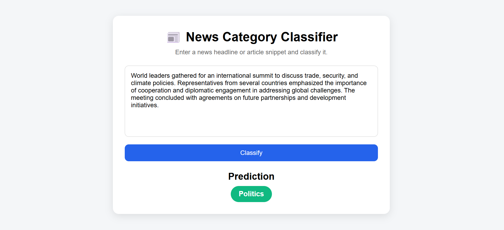

# 📰 NewsSense - Intelligent News Classification using NLP

## 📌 Overview

NewsSense is a Machine Learning and Natural Language Processing (NLP) project that automatically classifies news articles into one of four categories:

* Technology
* Sports
* Politics
* Entertainment

The project demonstrates the complete NLP workflow, including text preprocessing, feature extraction using Bag of Words, model training with Multinomial Naive Bayes, performance evaluation, model serialization, and deployment through a Flask web application.

---

## 🎯 Problem Statement

With the rapid growth of digital news content, manually organizing articles into categories can be time-consuming. This project aims to automate news categorization using Machine Learning techniques, allowing users to quickly identify the topic of a news article.

---

## 🛠️ Technologies Used

### Programming Language

* Python

### Libraries

* Pandas
* NumPy
* Scikit-learn
* Matplotlib
* Seaborn
* Joblib

### Web Development

* Flask
* HTML
* CSS

---

## 📂 Dataset

The dataset consists of text samples belonging to four categories:

| Category      | Description                                             |
| ------------- | ------------------------------------------------------- |
| Technology    | AI, software, gadgets, innovation, cybersecurity        |
| Sports        | Cricket, football, tournaments, athletes                |
| Politics      | Government policies, elections, international relations |
| Entertainment | Movies, music, celebrities, television                  |

This project uses a small synthetic dataset created for educational and learning purposes.

---

## 🔄 Project Workflow

### 1. Data Loading

The dataset is loaded using Pandas and separated into:

* Features (`text`)
* Labels (`category`)

### 2. Train-Test Split

The dataset is divided into:

* Training Data (80%)
* Testing Data (20%)

### 3. Text Vectorization

Text data cannot be directly processed by machine learning algorithms.

Therefore, **CountVectorizer (Bag of Words)** is used to convert text into numerical feature vectors.

Example:

| Sentence            | Vocabulary Representation |
| ------------------- | ------------------------- |
| AI is growing       | [1,1,0,0...]              |
| Cricket match today | [0,0,1,1...]              |

### 4. Model Training

The project uses:

**Multinomial Naive Bayes**

Why?

* Efficient for text classification
* Works well with Bag of Words features
* Fast training and prediction

### 5. Model Evaluation

Performance is measured using:

* Accuracy Score
* Classification Report
* Confusion Matrix

### 6. Model Serialization

The trained model and vectorizer are saved using Joblib:

* `model.pkl`
* `vectorizer.pkl`

### 7. Flask Deployment

A simple web interface allows users to:

1. Enter a news article or headline
2. Click **Classify**
3. Receive the predicted category.

---

## 📊 Model Performance

### Accuracy

**88.24%**

### Classification Metrics

| Category      | Precision | Recall | F1-Score |
| ------------- | --------- | ------ | -------- |
| Entertainment | 0.67      | 1.00   | 0.80     |
| Politics      | 1.00      | 1.00   | 1.00     |
| Sports        | 1.00      | 0.67   | 0.80     |
| Technology    | 0.86      | 0.86   | 0.86     |

### Confusion Matrix

The confusion matrix was used to analyze correct and incorrect classifications across all categories.

---
## 📸 Application Screenshot

The screenshot below shows the Flask web application used for news category prediction.



---

## 📁 Project Structure

```text
NewsLens/
│
├── app.py
├── model.pkl
├── vectorizer.pkl
├── synthetic_text_data.csv
│
├── templates/
│   └── index.html
│
├── static/
│   └── style.css
│ 
├── screenshot/
│   └── implementation.png
│ 
├── training.ipynb
└── requirements.txt
└── README.md
```

---

## 🚀 How to Run the Project

### Clone Repository

```bash
git clone <repository-url>
```

### Install Dependencies

```bash
pip install -r requirements.txt
```

### Run Flask Application

```bash
python app.py
```

### Open Browser

```text
http://127.0.0.1:5000
```

---

## 💡 Sample Inputs

### Technology

```text
Google announced a new artificial intelligence platform for cloud computing.
```

### Sports

```text
The cricket team secured a thrilling victory in the championship final.
```

### Politics

```text
The government introduced new economic reforms during a parliamentary session.
```

### Entertainment

```text
The movie received positive reviews and achieved record box office collections.
```

---

## 🎓 Learning Outcomes

Through this project, I learned:

* Natural Language Processing fundamentals
* Text preprocessing techniques
* Bag of Words feature extraction
* Multinomial Naive Bayes classification
* Model evaluation metrics
* Joblib model serialization
* Flask web application deployment
* End-to-end machine learning workflow

---

## ⚠️ Limitations

* Uses a small synthetic dataset.
* Intended for educational and learning purposes.
* Not designed for production-scale news classification.
* Performance may vary on real-world news articles.

---

## 👩‍💻 Author

N Sai Niharika

```
